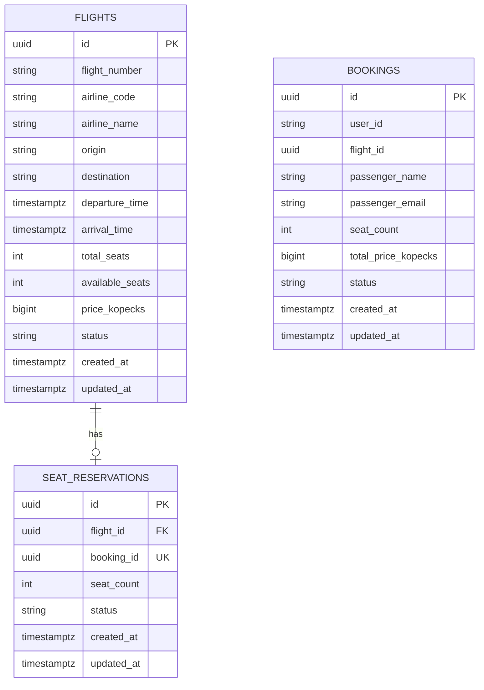

# ER Diagram

```mermaid
erDiagram
    FLIGHTS ||--o| SEAT_RESERVATIONS : has

    FLIGHTS {
        uuid id PK
        string flight_number
        string airline_code
        string airline_name
        string origin
        string destination
        timestamptz departure_time
        timestamptz arrival_time
        int total_seats
        int available_seats
        bigint price_kopecks
        string status
        timestamptz created_at
        timestamptz updated_at
    }

    SEAT_RESERVATIONS {
        uuid id PK
        uuid flight_id FK
        uuid booking_id UK
        int seat_count
        string status
        timestamptz created_at
        timestamptz updated_at
    }

    BOOKINGS {
        uuid id PK
        string user_id
        uuid flight_id
        string passenger_name
        string passenger_email
        int seat_count
        bigint total_price_kopecks
        string status
        timestamptz created_at
        timestamptz updated_at
    }
```
